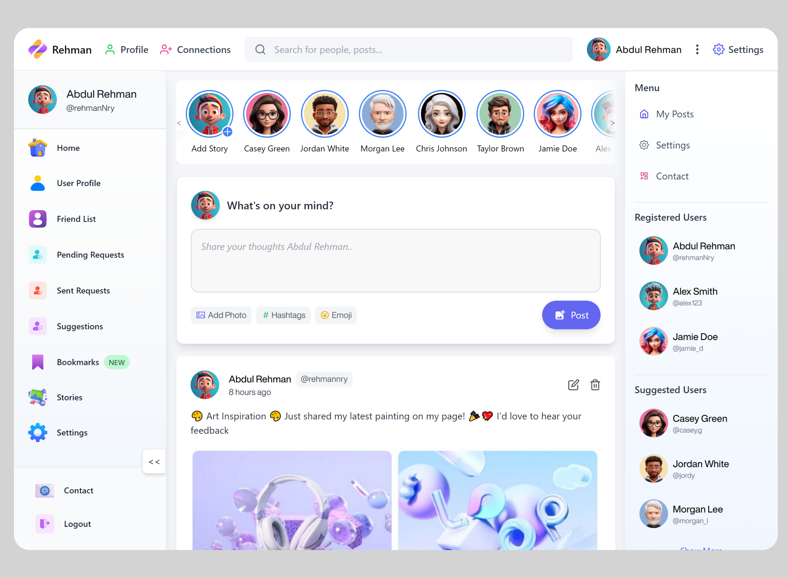

# Socio

Socio is a full-stack social networking application with a Next.js frontend and an Express + MongoDB backend. It includes authentication, posts, comments, stories, profile management, friend requests, notifications, bookmarks, and an AI chat route.



## Tech Stack

- Frontend: Next.js 14, React 18, Redux Toolkit, Tailwind CSS, Framer Motion
- Backend: Node.js, Express, MongoDB, Mongoose
- Auth: JWT and NextAuth with Google login
- Media: Cloudinary

## Project Structure

```text
SocialMediaApp-Main/
|- frontend/   # Next.js app
|- backend/    # Express API
`- README.md
```

## Features

- User registration and login
- Google authentication with NextAuth
- Create, edit, like, save, and comment on posts
- Stories UI and story creation
- Friend requests and connections
- Notifications
- Profile editing and avatar upload
- AI chat API route support

## Local Setup

### 1. Clone the repository

```bash
git clone https://github.com/Kalyan-23/Social-Network.git
cd Social-Network
```

### 2. Install dependencies

Install dependencies in both apps:

```bash
cd backend
npm install
cd ../frontend
npm install
```

### 3. Configure environment variables

Create a `.env` file in `backend/`:

```env
MONGO_URI=mongodb://localhost:27017/socialmedia
PORT=8000
CORS_ORIGIN=http://localhost:3000
JWT_SECRET=your_jwt_secret
CLOUDINARY_CLOUD_NAME=your_cloudinary_cloud_name
CLOUDINARY_API_KEY=your_cloudinary_api_key
CLOUDINARY_API_SECRET=your_cloudinary_api_secret
```

Create a `.env.local` file in `frontend/`:

```env
NEXT_PUBLIC_BACKEND_API=http://localhost:8000

NEXTAUTH_URL=http://localhost:3000
NEXTAUTH_SECRET=your_nextauth_secret

GOOGLE_CLIENT_ID=your_google_client_id
GOOGLE_CLIENT_SECRET=your_google_client_secret

OPENAI_API_KEY=your_openai_api_key
OPENAI_MODEL=gpt-4.1-mini

# Optional alternative for chat route
GROQ_API_KEY=your_groq_api_key
GROQ_MODEL=openai/gpt-oss-20b
```

### 4. Start the backend

```bash
cd backend
npm run dev
```

### 5. Start the frontend

```bash
cd frontend
npm run dev
```

Frontend runs on `http://localhost:3000` and backend runs on `http://localhost:8000` by default.

## Deployment

Recommended setup:

- Frontend: Vercel
- Backend: Vercel, Railway, or Render
- Database: MongoDB Atlas

Deployment order:

1. Deploy the backend
2. Copy the deployed backend URL
3. Set `NEXT_PUBLIC_BACKEND_API` in the frontend to that URL
4. Deploy the frontend

### Backend Environment Variables

```env
MONGO_URI=...
PORT=8000
CORS_ORIGIN=https://your-frontend-domain
JWT_SECRET=...
CLOUDINARY_CLOUD_NAME=...
CLOUDINARY_API_KEY=...
CLOUDINARY_API_SECRET=...
```

### Frontend Environment Variables

```env
NEXT_PUBLIC_BACKEND_API=https://your-backend-domain
NEXTAUTH_URL=https://your-frontend-domain
NEXTAUTH_SECRET=...
GOOGLE_CLIENT_ID=...
GOOGLE_CLIENT_SECRET=...
OPENAI_API_KEY=...
OPENAI_MODEL=gpt-4.1-mini
GROQ_API_KEY=...
GROQ_MODEL=openai/gpt-oss-20b
```

## Important Security Note

Do not commit real secrets to the repository. If any real OAuth, database, JWT, Cloudinary, OpenAI, or Groq credentials were previously pushed, rotate them before deployment.

## Scripts

Backend:

```bash
npm run dev
npm start
```

Frontend:

```bash
npm run dev
npm run build
npm start
```

## Repository

GitHub: https://github.com/Kalyan-23/Social-Network
